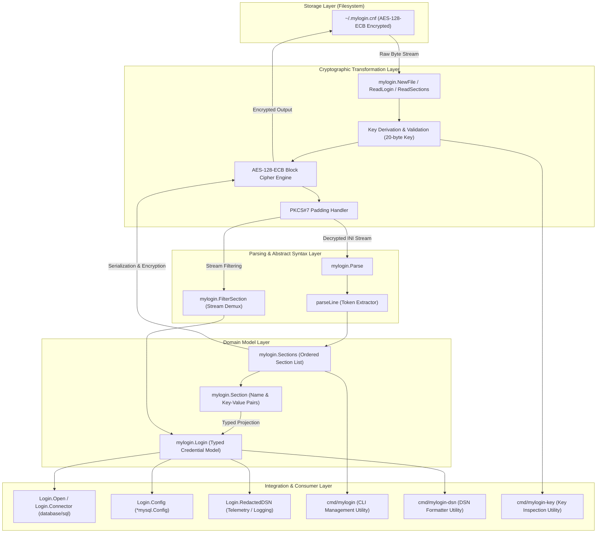
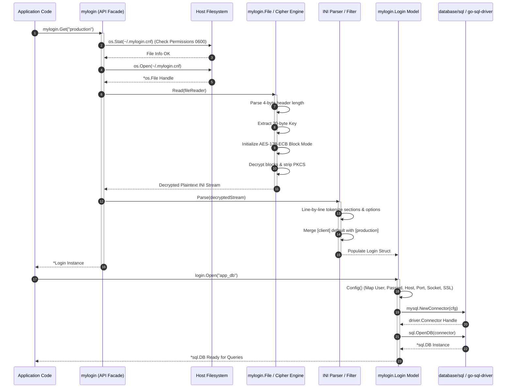
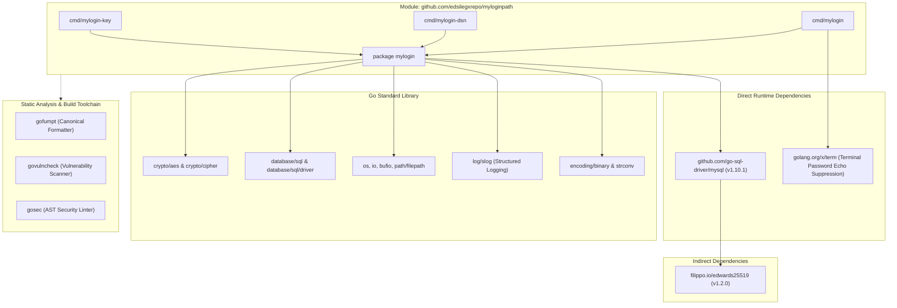
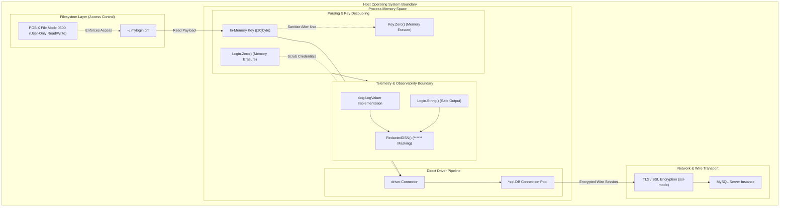

# Architecture and Technical Specification: `myloginpath`

This document details the software architecture, control flow, security profile, concurrency model, and operational characteristics of the `myloginpath` Go module. It is intended for systems architects, security engineers, and software engineers integrating MySQL login path management into enterprise infrastructure.

---

## 1. Architecture, Design Choices, Assumptions, Edge Cases, and Efficiency

### 1.1 Architectural Overview

The `myloginpath` library provides serialization, deserialization, manipulation, and runtime database driver integration for MySQL `.mylogin.cnf` configuration files. The internal architecture decouples file-format cryptographic handling from AST parsing, in-memory domain modeling, and SQL connection management.



### 1.2 Design Choices and Rationale

1. **Separation of Storage, Crypto, and Model Layers**:
   - Cryptographic decoding resides in [`mylogin.go`](./mylogin.go), operating on general `io.Reader` and `io.Writer` interfaces. This allows processing in-memory byte buffers, mock streams, and filesystem files identically without tight coupling to OS paths.
   - The structured AST is modeled in [`sections.go`](./sections.go) via the `Sections` slice and `Section` struct, preserving file order, arbitrary non-standard options, and unparsed entries.
   - The high-level credential model resides in [`login.go`](./login.go) via the `Login` struct, exposing strongly typed fields (`User`, `Password`, `Host`, `Port`, `Socket`, `Extra`).

2. **Full Compatibility with MySQL `mysql_config_editor`**:
   - The library strictly adheres to the format established by MySQL's C++ `mysql_config_editor` utility:
     - 4-byte little-endian header length prefix.
     - 20-byte key header where the 3 most significant bits of each byte are zeroed (`key[i] &= 0x1F`).
     - AES-128-ECB cipher algorithm.
     - 16-byte aligned PKCS#7 / zero padding.

3. **In-Memory Credential Scrubbing**:
   - Cryptographic keys (`Key`) and connection configurations (`Login`) implement explicit `.Zero()` methods utilizing pointer clearing and byte-level wiping to reduce the exposure window of sensitive bytes in process memory.

4. **Direct `driver.Connector` Integration**:
   - Traditional MySQL Go implementations build a Data Source Name (DSN) string (`user:pass@tcp(host:port)/db`) and invoke `sql.Open("mysql", dsn)`. If the driver logs connection attempts, failures, or errors, the password string may be written to standard log streams.
   - `Login.Connector(db)` directly returns a `driver.Connector` utilizing `mysql.NewConnector`, and `Login.Open(db)` returns `*sql.DB` via `sql.OpenDB`. This keeps credentials encapsulated within driver structs, avoiding string formatting entirely.

### 1.3 Assumptions

- **Filesystem Boundary as Root of Trust**: The security of `.mylogin.cnf` relies on host-level OS permissions (POSIX mode `0600`). Any local user possessing read permissions on the file can derive the key and decrypt the stored credentials.
- **Single-User Keying**: The encryption key is randomly generated at file creation time and stored directly within the file header. The key protects against casual inspection, but does not provide multi-tenant cryptographic isolation.
- **Synchronous Execution Profile**: Reading, writing, and parsing operations are CPU-bound and disk-bound; they are executed synchronously without internal background workers.

### 1.4 Edge Cases and Failure Modes

| Edge Case | Root Cause / Context | Handling Strategy |
| :--- | :--- | :--- |
| **Corrupted / Truncated Key Header** | File size less than 24 bytes (4-byte length + 20-byte key). | Explicit length check in [`Read`](./mylogin.go#L340); returns `io.ErrUnexpectedEOF` without allocating decryption buffers. |
| **Non-Multiple-of-16 Payload Length** | Bitrot or truncated ciphertext segment. | Handled in [`Decode`](./mylogin.go#L294); returns an error indicating invalid AES block size alignment. |
| **Corrupt PKCS#7 Padding Byte** | Ciphertext tampered or invalid encryption key. | Checked during block depadding; padded length is validated to not exceed total block length or underflow to negative values. |
| **Blank Lines and Dangling Newlines** | Plaintext INI containing empty lines or `\r\n`. | [`parseLine`](./login.go#L299) safely trims whitespace and validates length before indexing into `line[0]`. Trailing `\r` is stripped for cross-platform consistency. |
| **Unquoted vs. Quoted Values** | MySQL allows `host = localhost` and `host = "localhost"`. | [`parseLine`](./login.go#L299) unquotes double quotes (`"..."`) when present, while retaining raw values when unquoted. |
| **Invalid Port Numbers** | Port specified as non-numeric string. | [`parseLine`](./login.go#L299) runs `strconv.ParseUint(v, 10, 16)` and fails if out of bounds (`0-65535`). |
| **Windows Permissions vs. POSIX** | Windows filesystem ACLs lack standard POSIX `0600` bitmasks. | Platform-specific file checking in [`defaultfile_windows.go`](./defaultfile_windows.go) bypasses POSIX permission checks while [`mylogin.go`](./mylogin.go#L126) enforces `0600` on Unix platforms. |
| **Concurrent File Modification** | External process (`mysql_config_editor`) writes while reading. | [`WriteFile`](./mylogin.go#L471) writes to a temporary file in the same directory (`.tmp-*`) and executes an atomic `os.Rename`, preventing partial file corruptions. |

### 1.5 Performance and Computational Efficiency

- **Allocation Containment**: In [`Encode`](./mylogin.go#L404) and [`Decode`](./mylogin.go#L294), block processing occurs in-place where feasible. Buffer slices are pre-allocated with known capacity calculated from plaintext length and 16-byte block alignment boundaries.
- **Stream Filtering**: [`FilterSection`](./filter.go#L11) reads the decrypted INI stream lazily line-by-line, demultiplexing only the targeted section rather than loading the entire file into secondary parse trees when single-section reading is requested via [`ReadLogin`](./mylogin.go#L156).
- **Driver Connector Re-use**: `Login.Open()` configures the standard library connection pool (`*sql.DB`), allowing persistent socket reuse across thousands of transactions without re-reading or re-decrypting `.mylogin.cnf`.

---

## 2. Data Flow and Control Logic

### 2.1 Operational Flow

The operational life cycle consists of three primary workflows:
1. **Read & Connect**: Decrypting credentials and establishing a database session.
2. **Programmatic / CLI Administration (`set` / `remove` / `list`)**: Modifying configuration sections and persisting ciphertext.
3. **Format Transformation**: Converting binary cipher streams into JSON, DSN, or CLI replay commands.

### 2.2 Component Relationships and Code Interfaces

- [`mylogin.go`](./mylogin.go): Entry points for file reading (`Default()`, `Get()`, `Load()`), cipher initialization (`cipher()`), serialization (`Encode()`), and deserialization (`Decode()`).
- [`login.go`](./login.go): Domain model for credentials (`Login`), DSN generator (`FormatDSN()`, `RedactedDSN()`), structured logger integration (`LogValue()`), and SQL driver attachment (`Connector()`, `Open()`).
- [`sections.go`](./sections.go): Collection model (`Sections`, `Section`) representing the configuration file AST. Supports section-level querying, deletion, insertion, deep cloning, and serialization to INI syntax.
- [`filter.go`](./filter.go): Low-level stream adapter isolating targeted sections during streaming reads.
- [`cmd/mylogin/main.go`](./cmd/mylogin/main.go): Pure-Go CLI implementing administrative subcommands (`set`, `remove`, `list`) and dump flags (`-json`, `-replay`, `-remove`, `-template`).
- [`cmd/mylogin-dsn/main.go`](./cmd/mylogin-dsn/main.go): Command-line DSN generation utility.
- [`cmd/mylogin-key/main.go`](./cmd/mylogin-key/main.go): Key inspection utility.

### 2.3 End-to-End Sequence Diagram

The following sequence illustrates the flow of an application requesting a database handle via `mylogin.Get("production")` followed by `login.Open("app_db")`.



---

## 3. Performance and Scalability

### 3.1 Concurrency Model and Thread Safety Guarantees

1. **Read Immutability**:
   - Instances of `*Login` and `Sections` returned by reading functions (`Default()`, `Get()`, `Load()`) are independent memory structures.
   - Multiple goroutines may concurrently execute read-only methods (`DSN()`, `FormatDSN()`, `RedactedDSN()`, `Config()`, `Open()`, `Connector()`, `String()`, `LogValue()`) on the same `*Login` pointer without locking, as these methods perform no internal state mutation.

2. **Mutation Isolation via Deep Copying**:
   - If an application needs to mutate a `Login` or `Sections` instance across goroutines, it must invoke `login.Clone()` or `sections.Clone()`.
   - `Clone()` allocates new string pointers and duplicates `Extra` option maps, ensuring that zero memory aliasing occurs between caller threads.

3. **Disk Serialization Atomicity**:
   - When updating `.mylogin.cnf` files via `Sections.WriteFile()` or `mylogin.WriteFile()`, atomic file replacement is used:
     ```go
     // Code pattern used in WriteFile:
     tmp, err := os.CreateTemp(dir, ".tmp-mylogin-*")
     // ... write encrypted payload ...
     os.Rename(tmp.Name(), targetFile)
     ```
   - This prevents partial writes, truncated reads, or file corruption if multiple external processes or OS signals interrupt file generation.

### 3.2 Channel Structures and Worker Design

- The library does not spawn persistent background goroutines or maintain internal Go channels.
- **Architectural Rationale**: Credential configuration parsing is an ephemeral initialization task. Spawning persistent background workers or channel pipelines would add synchronization overhead, thread leakage risk, and garbage collection pressure without throughput benefit.
- Concurrency scaling is delegated to Go's standard database connection pool ([`database/sql`](https://golang.org/pkg/database/sql/)). Once `Login.Open()` returns a `*sql.DB`, connection allocation, idle management, and socket pooling across thousands of goroutines are managed natively by Go's driver infrastructure.

---

## 4. Dependencies and Runtime Environment

### 4.1 Dependency Classification



### 4.2 Module Inventory

| Module / Component | Version Requirement | Purpose / Architectural Role |
| :--- | :--- | :--- |
| **Go Toolchain** | `>= 1.24.0` | Runtime environment, compiler, and standard library. |
| **`github.com/go-sql-driver/mysql`** | `v1.10.1` | Driver implementation for `mysql.Config` and `mysql.NewConnector`. |
| **`filippo.io/edwards25519`** | `v1.2.0` | Cryptographic dependency transitively required by `go-sql-driver/mysql`. |
| **`golang.org/x/term`** | Standard Subrepo | Terminal raw mode handling for masked password prompt entry in CLI. |
| **`crypto/aes`** | Standard Library | Primitive AES block cipher execution. |
| **`log/slog`** | Standard Library | Structured logging contract (`slog.LogValuer`). |

---

## 5. Security Architecture

### 5.1 Threat Model and Cryptographic Limitations

> [!WARNING]
> **Cryptographic Scope Limitation**:
> MySQL's `.mylogin.cnf` format employs **AES-128 in Electronic Codebook (ECB) mode** with a key derived from 20 bytes stored directly in the file header.
> - **ECB Mode**: ECB does not use an Initialization Vector (IV). Identical plaintext blocks produce identical ciphertext blocks, making it theoretically susceptible to pattern leakage in large files.
> - **Header Key Storage**: The encryption key is stored within the file itself. Consequently, `.mylogin.cnf` is an **obfuscation mechanism**, not an authenticated encryption envelope (such as AES-GCM) or a hardware-secured vault (such as KMS or TPM).
> - **Security Boundary**: The operational security of `.mylogin.cnf` depends entirely on operating system file permissions.

### 5.2 Security Architecture Diagram



### 5.3 Defense-in-Depth and Mitigation Layers

1. **Host-Level Access Control (RBAC & Discretionary Access Control)**:
   - On POSIX platforms, [`CheckPermissions`](./mylogin.go#L126) validates that `.mylogin.cnf` has file permissions no more permissive than `0600` (`-rw-------`). If group or other read/write bits are set, execution is aborted with an error to prevent multi-user access on shared infrastructure.
   - When generating or updating configuration files via [`WriteFile`](./mylogin.go#L471), the file descriptor is created strictly with `0600` flags.

2. **Accidental Credential Exposure Mitigation**:
   - **`Login.String()`**: The default string representation of `Login` prints a redacted connection string via `RedactedDSN()`. Even if an engineer writes `fmt.Println(login)` or prints debug objects, plaintext passwords are never emitted.
   - **`slog.LogValuer`**: `Login` implements the `slog.LogValuer` interface:
     ```go
     func (l *Login) LogValue() slog.Value {
         // Emits structured group with password masked as "******"
     }
     ```
     Any structured log call (`slog.Info("Connecting", "login", login)`) formats sensitive fields safely.

3. **Memory Exposure Containment**:
   - [`Key.Zero()`](./mylogin.go#L63) and [`Login.Zero()`](./login.go#L111) provide zeroing mechanisms. Applications processing credentials in long-lived services can explicitly invoke `Zero()` to scrub key bytes and password strings from heap memory immediately after establishing database connections.

4. **Transport-Layer Security (TLS / SSL)**:
   - Client options parsed from `.mylogin.cnf` (`ssl-mode`) are mapped directly into `mysql.Config.TLSConfig`:
     - `DISABLED` -> `false`
     - `REQUIRED` -> `true`
     - `VERIFY_CA` / `VERIFY_IDENTITY` -> `custom` / driver TLS modes.
   - Credentials decrypted from `.mylogin.cnf` are protected in transit between the host application and the remote MySQL server across untrusted enterprise networks.
