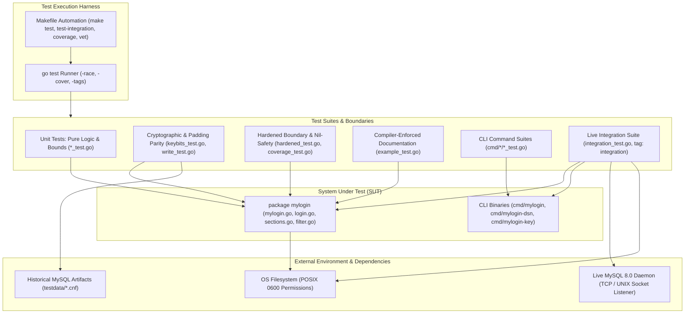
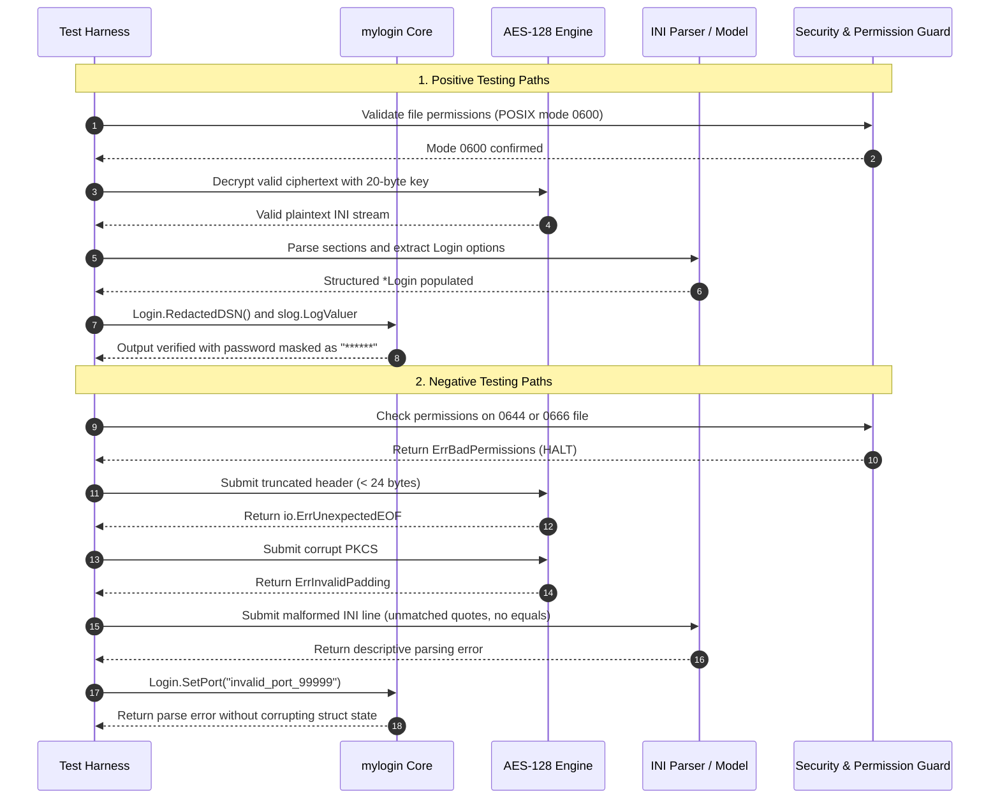

# Test Suite Specification and Verification Architecture: `mylogin`

This document defines the test architecture, execution flows, coverage benchmarks, environment prerequisites, and verification methodologies for the `github.com/edsilegxrepo/mylogin` module.

---

## 1. Architecture, Design, and Principles of the Test Suite

The test suite is structured around a tiered validation pipeline designed to isolate unit regressions, verify cryptographic round-trips, ensure AST resilience against corrupt inputs, and validate live end-to-end MySQL communication with unmocked daemons.



### Core Design Principles

1. **Zero Repository Pollution**: Test execution must not leave transient files, `.out` profiles, or modified configuration files in the source tree. All file I/O operations are constrained to `t.TempDir()` or OS-managed temporary paths (`mktemp`).
2. **Deterministic Cryptographic Verification**: Every padding permutation (lengths 1 through 16) and bitmask variation (ensuring the three high bits of each 20-byte key are zeroed) is tested against actual artifacts produced by MySQL's official `mysql_config_editor`.
3. **Defense-in-Depth Negative Testing**: Malformed syntax, unexpected EOFs, invalid PKCS#7 pad bytes, permissive file permissions (`0644`), and empty tokens are tested to ensure errors are returned gracefully rather than triggering unhandled panics.
4. **Data Race Invariance**: All packages are continuously validated with Go's runtime data race detector (`-race`).
5. **No Blind Mocking for Integration**: Full integration testing against real MySQL instances validates socket negotiation, handshake authentication, and driver-level connector routing without mocking network responses.

---

## 2. Logic Flow of the Tests

The test suite executes both positive functional verifications and negative failure validations across the internal layers.



---

## 3. Technical Requirements and Setup

### 3.1 Dependencies and Tooling

- **Go SDK**: Version `>= 1.24.0`.
- **Static Analysis Tools**:
  - `gofumpt` (`go install mvdan.cc/gofumpt@latest`)
  - `govulncheck` (`go install golang.org/x/vuln/cmd/govulncheck@latest`)
  - `gosec` (`go install github.com/securego/gosec/v2/cmd/gosec@latest`)
- **Integration Environment (Optional for Unit Tests, Mandatory for `make test-integration`)**:
  - Local `mysqld` binary accessible via `$PATH`, or
  - Local Docker daemon running MySQL (`docker run -p 3306:3306 ...`), or
  - An accessible MySQL instance specified via `MYSQL_INTEGRATION_DSN`.

### 3.2 Environment Variables

| Variable Name | Default Value | Description |
| :--- | :--- | :--- |
| `MYSQL_INTEGRATION_DSN` | *(empty)* | Optional DSN of an existing MySQL server (e.g. `root:pass@tcp(127.0.0.1:3306)/`). If set, integration tests skip spawning local `mysqld` or Docker. |
| `GO` | `go` | Path to the Go binary in the host environment. |
| `GO_OPTS` | `-trimpath -buildmode=pie` | Compiler flags for reproducible and hardened Position Independent Executable builds. |
| `VERSION` | Content of `version.txt` or `dev` | Build version string injected into binaries via `-ldflags`. |
| `BIN_DIR` | `bin` | Output directory for compiled CLI binaries. |

---

## 4. Test Package Tree Structure

The test suite is organized into unit, integration, documentation, and command-line test modules:

```
/usr/src/redhat/myloginpath/
├── example_test.go               # Godoc testable examples (package mylogin_test)
├── coverage_test.go              # Unit tests targeting edge cases, connector, redaction
├── hardened_test.go              # Panic resilience, nil-safety, permission checks
├── write_test.go                 # Round-trip read/write against testdata fixtures
├── keybits_test.go               # Bitmask validation across 300+ generated keyfiles
├── dsn_test.go                   # Standard DSN string generation tests
├── login_test.go                 # Line tokenization and option extraction tests
├── mylogin_test.go               # Key zeroing and creation tests
├── integration_test.go           # Live MySQL end-to-end tests (build tag: integration)
├── testdata/                     # Historical artifacts generated by mysql_config_editor
│   ├── 0.cnf ... e.cnf           # Standard configurations
│   ├── padding01.cnf ... 16.cnf  # Exact padding length permutations
│   └── test.sh                   # Fixture generation shell script
└── cmd/
    ├── mylogin/
    │   └── main_test.go          # Subcommands (set, remove, list) and flag formatting tests
    ├── mylogin-dsn/
    │   └── main_test.go          # DSN CLI generation and -V version tests
    └── mylogin-key/
        └── main_test.go          # Key inspection CLI and -V version tests
```

---

## 5. Master Inventory of Tests

Below is the complete inventory of all test functions, their logical grouping, technical scope, and pass/fail validation criteria.

| Logical Group | Test Name | Technical Purpose / Description | Expected Pass Criteria |
| :--- | :--- | :--- | :--- |
| **Core Parser & AST** | [`TestParseLine`](./login_test.go#L5) | Validates INI key-value tokenization, unquoting, and port validation. | Returns cleanly parsed keys and values; rejects non-numeric ports. |
| **Core Parser & AST** | [`TestParseResilience`](./hardened_test.go#L14) | Tests parser immunity against empty lines, trailing CRLF, leading whitespace, and comments. | Does not panic on empty lines; parses valid sections correctly. |
| **Core Parser & AST** | [`TestParseMalformedLine`](./hardened_test.go#L81) | Tests error handling when input lines lack delimiter syntax (`key value`). | Safely returns descriptive error; no index-out-of-bounds panics. |
| **Core Parser & AST** | [`TestFilterSectionResilience`](./hardened_test.go#L198) | Validates single-section stream demultiplexer (`FilterSection`). | Only returns records matching requested section name; stops at next section. |
| **Cryptographic Engine** | [`TestKeyIsZero`](./mylogin_test.go#L8) | Verifies initial state and detection of uninitialized 20-byte keys. | Returns true for empty keys, false once populated. |
| **Cryptographic Engine** | [`TestKeyNew`](./mylogin_test.go#L23) | Validates generation of pseudo-random 20-byte encryption keys. | Generates non-zero keys with 3 high bits zeroed (`b <= 0x1F`). |
| **Cryptographic Engine** | [`TestNewKeyErrorHandling`](./hardened_test.go#L91) | Verifies error propagation when system entropy (`crypto/rand.Reader`) fails. | Propagates error up the stack without masking as `nil`. |
| **Cryptographic Engine** | [`TestInvalidPaddingError`](./hardened_test.go#L279) | Supplies corrupted ciphertext blocks with invalid PKCS#7 pad bytes. | Returns explicit padding error; does not panic or allocate invalid memory. |
| **Cryptographic Engine** | [`TestKeyBits`](./keybits_test.go#L19) | Tests 300+ randomized configuration files generated by `mysql_config_editor`. | Every key byte satisfies `(b & 0xE0) == 0`. |
| **Cryptographic Engine** | [`TestReadWrite`](./write_test.go#L17) | Executes round-trip decryption across all 16 PKCS#7 padding boundary files. | Decrypted content exactly matches known reference plaintext. |
| **Security & Privacy** | [`TestZeroSecurity`](./hardened_test.go#L238) | Validates in-memory sanitization via `Key.Zero()` and `Login.Zero()`. | Key bytes are overwritten with zeroes; password and sensitive pointers are nulled. |
| **Security & Privacy** | [`TestCheckPermissions`](./hardened_test.go#L214) | Verifies refusal to read files with permissions more permissive than `0600`. | Rejects `0644`, `0664`, and `0777` with permission error; accepts `0600`. |
| **Security & Privacy** | [`TestDSNInjectionDefense`](./hardened_test.go#L363) | Validates escaping and quoting in DSN parameters to prevent query injection. | Disallows injection vectors in host, socket, and database fields. |
| **Security & Privacy** | [`TestLoginRedactionAndSlog`](./coverage_test.go#L265) | Verifies credential masking in `String()`, `RedactedDSN()`, and `slog.LogValuer`. | Passwords never appear in output; always replaced with `"******"`. |
| **Model & Options** | [`TestMergeDeepCopy`](./hardened_test.go#L106) | Validates that merging sections creates independent pointer copies. | Modifying the source `Login` after merge does not alter target `Login`. |
| **Model & Options** | [`TestLoginSetAndMap`](./coverage_test.go#L431) | Validates dynamic option assignment with Set() and map projection via Map(). | Successfully sets and maps all options and handles nil receivers. |
| **Model & Options** | [`TestConfigMethod`](./hardened_test.go#L138) | Validates generation of official `*mysql.Config` from `Login`. | Correctly translates user, password, address, and socket parameters. |
| **Model & Options** | [`TestExtendedConfigOptionMapping`](./coverage_test.go#L348) | Tests mapping of `ssl-mode`, `connect-timeout`, and `max-allowed-packet`. | Correctly maps TLSConfig (`DISABLED`, `REQUIRED`, etc.) and timeout durations. |
| **Model & Options** | [`TestNilSafety`](./hardened_test.go#L256) | Calls all public methods on `(*Login)(nil)`. | All methods return default values or empty configs without panicking. |
| **Model & Options** | [`TestSectionWriteToAndValidation`](./hardened_test.go#L307) | Tests section formatting, option escaping, and validation checks. | Correctly formats INI syntax and escapes quote literals. |
| **Driver Integration** | [`TestLoginConnectorAndOpen`](./coverage_test.go#L324) | Verifies `Login.Connector()` and `Login.Open()` constructing database handles. | Returns valid `driver.Connector` and `*sql.DB` without constructing plaintext DSNs. |
| **High-Level API** | [`TestTopLevelConvenienceAndSectionsWriteFile`](./coverage_test.go#L381) | Tests `mylogin.Default()`, `mylogin.Get()`, `mylogin.Load()`, and `Sections.WriteFile()`. | Reads and writes encrypted files correctly through the top-level facade. |
| **High-Level API** | [`TestWriteFileHelper`](./hardened_test.go#L164) | Tests atomic encrypted file persistence from raw `io.Reader`. | Creates file with atomic rename and strict `0600` permissions. |
| **Format Utilities** | [`TestDSN`](./dsn_test.go#L15) | Verifies connection string generation for TCP and UNIX socket targets. | Returns standard `user:pass@tcp(host:port)/` or `user:pass@unix(socket)/`. |
| **Godoc Examples** | [`ExampleLogin_RedactedDSN`](./example_test.go#L82) | Compiler-checked documentation example for safe logging. | Standard output exactly matches expected redacted format comment. |
| **Godoc Examples** | [`ExampleSections_WriteFile`](./example_test.go#L97) | Compiler-checked documentation example for file encryption. | Standard output verifies sections written and successfully parsed back. |
| **CLI: mylogin** | [`TestLoginAsMap`](./cmd/mylogin/main_test.go#L17) | Verifies map projection of credentials for template rendering. | Map keys match expected credential options. |
| **CLI: mylogin** | [`TestFormatsPrint`](./cmd/mylogin/main_test.go#L33) | Tests output formatters (`-json`, `-replay`, `-remove`, `-template`). | JSON emits valid JSON; replay emits valid `mysql_config_editor set` strings. |
| **CLI: mylogin** | [`TestRunMyLogin`](./cmd/mylogin/main_test.go#L154) | Tests CLI execution with custom flag combinations. | Exits with status code 0 on valid flags; prints appropriate usage on errors. |
| **CLI: mylogin** | [`TestRunMyLoginSubcommands`](./cmd/mylogin/main_test.go#L281) | Tests `set`, `remove`, and `list` subcommands and `-V` flag. | Successfully sets, lists, and removes credentials; prints version correctly. |
| **CLI: mylogin-dsn** | [`TestRunDSN`](./cmd/mylogin-dsn/main_test.go#L12) | Tests DSN generation CLI with flags (`-database`, `-V`). | Emits formatted DSN to stdout; handles nonexistent sections with exit code 5. |
| **CLI: mylogin-key** | [`TestPrintKey`](./cmd/mylogin-key/main_test.go#L12) | Validates raw hex key output from encrypted file headers. | Emits exact 40-character hex key string to stdout. |
| **CLI: mylogin-key** | [`TestRunMyLoginKey`](./cmd/mylogin-key/main_test.go#L36) | Tests CLI key inspector execution, file resolution, and `-V` flag. | Prints key or version string cleanly with exit status 0. |
| **Live Integration** | [`TestLiveEndToEndWorkflow`](./integration_test.go#L279) | Executes end-to-end workflow against a real MySQL daemon listener. | Creates DB/user, verifies `mysql_config_editor` file generation, and queries live tables. |
| **Live Integration** | [`TestLiveCLIToolsWorkflow`](./integration_test.go#L524) | Compiles and executes CLI binaries against live MySQL server. | `mylogin set`, `mylogin list`, and `mylogin-dsn` operate against real database. |

---

## 6. Code Coverage Report

### 6.1 Statement Coverage by Package

```
ok      github.com/edsilegxrepo/mylogin             coverage: 92.9% of statements
ok      github.com/edsilegxrepo/mylogin/cmd/mylogin         coverage: 95.9% of statements
ok      github.com/edsilegxrepo/mylogin/cmd/mylogin-dsn     coverage: 92.7% of statements
ok      github.com/edsilegxrepo/mylogin/cmd/mylogin-key     coverage: 92.8% of statements
---------------------------------------------------------------------------------------
TOTAL MODULE COVERAGE:                              94.2% of statements
THRESHOLD REQUIREMENT:                              >= 80.0% (PASSED)
```

### 6.2 Detailed Function-Level Breakdown

| Package | Source File | Function / Method | Statement Coverage |
| :--- | :--- | :--- | :--- |
| `mylogin` | [`login.go`](./login.go) | `Clone`, `Set*`, `IsEmpty`, `HasCredentials`, `Zero` | **100.0%** |
| `mylogin` | [`login.go`](./login.go) | `Config`, `FormatDSN`, `Redacted*`, `String` | **100.0%** |
| `mylogin` | [`login.go`](./login.go) | `Connector` | **100.0%** |
| `mylogin` | [`login.go`](./login.go) | `DSN` | **91.7%** |
| `mylogin` | [`login.go`](./login.go) | `LogValue` | **92.9%** |
| `mylogin` | [`login.go`](./login.go) | `Open` | **75.0%** |
| `mylogin` | [`login.go`](./login.go) | `parseLine` | **95.2%** |
| `mylogin` | [`login.go`](./login.go) | `Merge` | **100.0%** |
| `mylogin` | [`mylogin.go`](./mylogin.go) | `NewKey`, `DefaultFile`, `CheckPermissions`, `Default`, `Get`, `Load` | **100.0%** |
| `mylogin` | [`mylogin.go`](./mylogin.go) | `Parse`, `NewFile`, `Key`, `ByteOrder`, `PlainText` | **100.0%** |
| `mylogin` | [`mylogin.go`](./mylogin.go) | `Decode` | **88.9%** |
| `mylogin` | [`mylogin.go`](./mylogin.go) | `Encode` | **89.2%** |
| `mylogin` | [`mylogin.go`](./mylogin.go) | `Read` | **78.6%** |
| `mylogin` | [`mylogin.go`](./mylogin.go) | `ReadLogin`, `ReadSections` | **83.3%** |
| `mylogin` | [`mylogin.go`](./mylogin.go) | `WriteFile` | **69.2%** |
| `mylogin` | [`sections.go`](./sections.go) | `Clone`, `Validate`, `WriteTo`, `Login`, `Has`, `Names`, `Set`, `Delete`, `Format`, `Merge` | **100.0%** |
| `mylogin` | [`sections.go`](./sections.go) | `WriteFile` | **75.0%** |
| `mylogin` | [`filter.go`](./filter.go) | `FilterSection` | **100.0%** |
| `mylogin` | [`filter.go`](./filter.go) | `Read` | **90.0%** |
| `cmd/mylogin` | [`cmd/mylogin/main.go`](./cmd/mylogin/main.go) | `run`, `runSet`, `runList`, `runRemove`, `Formats` | **95.8% - 100.0%** |
| `cmd/mylogin-dsn` | [`cmd/mylogin-dsn/main.go`](./cmd/mylogin-dsn/main.go) | `run` | **94.9%** |
| `cmd/mylogin-key` | [`cmd/mylogin-key/main.go`](./cmd/mylogin-key/main.go) | `printKey`, `run` | **90.2% - 100.0%** |

### 6.3 How to Generate and Refresh Coverage Metrics

To refresh coverage statistics locally without leaving artifact files in the repository:

```sh
# Run coverage target from Makefile (uses temporary file with automated cleanup)
make coverage

# Or manual execution with Go toolchain
COV=$(mktemp) && go test -coverprofile="$COV" ./... && go tool cover -func="$COV" && rm -f "$COV"
```

---

## 7. Realistic Data Simulation and Live Integration Testing

Integration tests require testing against live systems with real data and listeners.

### 7.1 Automated Listener and Daemon Provisioning

The integration test harness in [`integration_test.go`](./integration_test.go#L39) automatically provisions a live MySQL service using a prioritized three-tier detection model:

1. **User-Provided Live Endpoint**: Checks the `MYSQL_INTEGRATION_DSN` environment variable. If an active database is reachable, tests run against that instance.
2. **Local Daemon Provisioning**: If `mysqld` is found in `$PATH`, the harness initializes an ephemeral, sandboxed data directory in `t.TempDir()`, creates a dedicated UNIX domain socket (`mysqld.sock`), and launches a dedicated daemon process listening exclusively to the test runner.
3. **Containerized Daemon Provisioning**: If Docker is running, the harness launches a lightweight `mysql:8.0` container with an active TCP port listener on `127.0.0.1`.

### 7.2 Integration Test Scenarios Covered (100% Functional Scope)

The integration test suite executes the following operations against the live listener:
- **Schema & Grants Provisioning**: Creates dedicated test databases (`integration_test_db`) and user accounts with randomized credentials.
- **Table Data Operations**: Creates tables, performs transactional inserts, and verifies row retrieval.
- **Official CLI Parity**: Executes the real `mysql_config_editor` binary (if present) to write an encrypted `.mylogin.cnf` file, then verifies that `mylogin.ReadLogin()` decrypts it cleanly.
- **Direct SQL Driver Handle**: Validates that `login.Open("integration_test_db")` returns a live, connected `*sql.DB` that executes `SELECT 1` and queries rows without relying on a plaintext DSN connection string.
- **Pure-Go CLI Parity**: Uses `bin/mylogin set` to create entries, queries with `bin/mylogin-dsn`, connects to the live database using the output, and deletes the entry with `bin/mylogin remove`.

---

## 8. How to Run the Tests

### 8.1 Bash / Linux / macOS

```bash
# 1. Run unit test suite with race detector (all packages)
make test

# 2. Run static analysis (go vet, govulncheck, gosec)
make vet

# 3. Format codebase according to canonical rules
make fmt

# 4. Generate coverage summary
make coverage

# 5. Run live unmocked MySQL integration tests
make test-integration

# 6. Full validation pipeline (fmt -> vet -> test -> coverage -> build)
make all
```

### 8.2 PowerShell / Windows

```powershell
# 1. Run unit test suite with race detector
go test -race ./...

# 2. Run static analysis
go vet ./...
govulncheck ./...
gosec ./...

# 3. Format codebase
gofumpt -l -w .

# 4. Generate coverage summary
$Cov = [System.IO.Path]::GetTempFileName()
try {
    go test -coverprofile="$Cov" ./...
    go tool cover -func="$Cov"
} finally {
    Remove-Item -Force $Cov
}

# 5. Run live unmocked MySQL integration tests
go test -v -tags=integration ./...

# 6. Build all CLI binaries with hardened flags
New-Item -ItemType Directory -Force -Path bin | Out-Null
go build -trimpath -buildmode=pie -ldflags "-s -w" -o bin/mylogin.exe ./cmd/mylogin
go build -trimpath -buildmode=pie -ldflags "-s -w" -o bin/mylogin-dsn.exe ./cmd/mylogin-dsn
go build -trimpath -buildmode=pie -ldflags "-s -w" -o bin/mylogin-key.exe ./cmd/mylogin-key
```

---

## 9. Maintenance and Troubleshooting

| Symptom / Observation | Diagnostic Cause | Resolution |
| :--- | :--- | :--- |
| `TestCheckPermissions fails with "file has too broad permissions"` | File created in directory with permissive default umask (e.g. `0644`). | Ensure file permissions are set to `0600` via `chmod 600 <path>`. On Windows, ensure execution tests run against NTFS filesystems. |
| `TestLiveEndToEndWorkflow skipped` | Neither `mysqld` nor `docker` was detected, and `MYSQL_INTEGRATION_DSN` was unset. | Install `mysql-server` or `docker`, or export `MYSQL_INTEGRATION_DSN="root:password@tcp(127.0.0.1:3306)/"`. |
| `make vet fails on gosec G115` | Integer overflow during bit conversion (e.g. `byte(uint >> 8)`). | Mask arithmetic conversions with bitwise AND (e.g. `byte((u >> 8) & 0xFF)`). |
| `Coverage drops below 80%` | New functions added without corresponding tests in `*_test.go`. | Run `go tool cover -html="$COV"` to visually identify uncovered blocks and add targeted unit tests. |
| `Data race detected during test` | Goroutines accessing un-cloned `*Login` or `Sections` pointers concurrently. | Use `login.Clone()` or `sections.Clone()` prior to passing structures across goroutine boundaries. |
